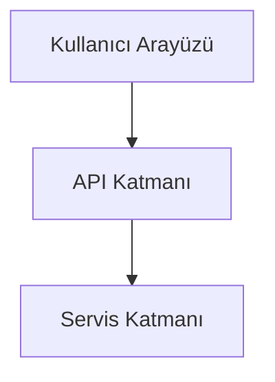

# BlogNest Projesi


## Proje Hakkında
BlogNest, ASP.NET Core tabanlı gelişmiş bir blog platformudur.



## Kurulum
```bash
git clone https://github.com/zeydalcan/BlogNest.git
dotnet restore
dotnet run
```

## Katkıda Bulunma
1. Fork oluşturun
2. Yeni branch açın
3. Değişikliklerinizi yapın
4. Pull Request gönderin
